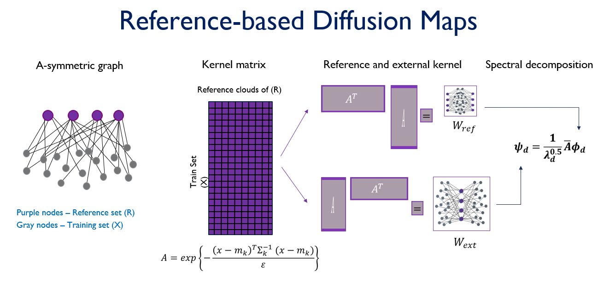

# REFERENCE-BASED DIFFUSION MAPS FOR ONE-CLASS CLASSIFICATION: APPLICATION TO MINE EXPLOSIONS IDENTIFICATION

 [-Thesis Book-](https://github.com/Itay-Niv/Reference-based-Diffusion-Maps-for-One-Class-Classsification-Seismic-Application/Itay_Niv_Thesis.pdf)
 
 
